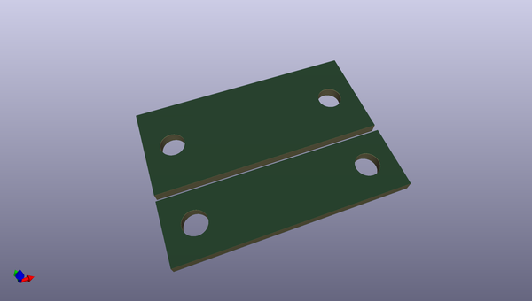

# OOMP Project  
## Robotic_Finger_Sensor  by sparkfunX  
  
oomp key: oomp_projects_flat_sparkfunx_robotic_finger_sensor  
(snippet of original readme)  
  
Robotic Finger Sensor   
========================  
  
  
  
    
  
[*Robotic Finger Sensor (SPX-14200)*](https://www.sparkfun.com/products/14200)    
  
[*Robotic Finger Sensor v2 (SPX-14687)*](https://www.sparkfun.com/products/14687)  
  
A robotic finger sensor capable of detecting very light touches. Uses the VCNL4040 IR distance sensor.   
  
Repository Contents  
------------------  
  
* **/Firmware** - Example Arduino sketch to demostrate how to read from the various sensors.  
* **/Hardware** - All the Eagle PCB design files (.brd, .sch). MOld files are included as well.   
  
License Information  
-------------------  
  
This product is _**open source**_!   
  
Please review the LICENSE.md file for license information.   
  
If you have any questions or concerns on licensing, please contact technical support on our [SparkFun forums](https://forum.sparkfun.com/viewforum.php?f=152).  
  
Distributed as-is; no warranty is given.  
  
- Your friends at SparkFun.  
  full source readme at [readme_src.md](readme_src.md)  
  
source repo at: [https://github.com/sparkfunX/Robotic_Finger_Sensor](https://github.com/sparkfunX/Robotic_Finger_Sensor)  
## Board  
  
  
## Schematic  
  
  
  
[schematic pdf](working_schematic.pdf)  
## Images  
