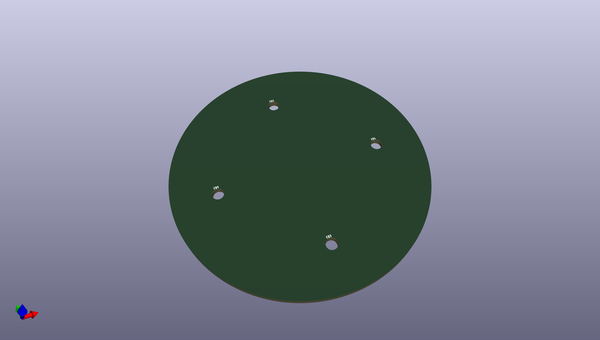

# OOMP Project  
## Rotary_Dial  by sparkfunX  
  
(snippet of original readme)  
  
- Rotary_Dial  
Stacked FR-4 Construction I/O Node  
  
  full source readme at [readme_src.md](readme_src.md)  
  
source repo at: [https://github.com/sparkfunX/Rotary_Dial](https://github.com/sparkfunX/Rotary_Dial)  
## Board  
  
  
## Schematic  
  
  
  
[schematic pdf](working_schematic.pdf)  
## Images  
