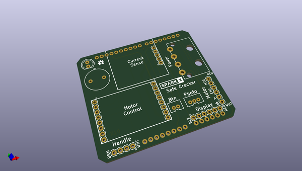
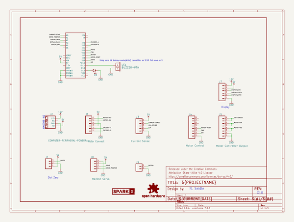
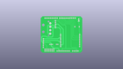
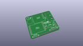
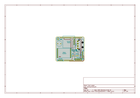
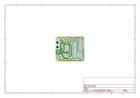
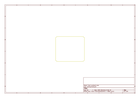
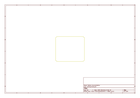
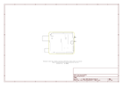

# OOMP Project  
## Safe_Cracker  by sparkfunX  
  
(snippet of original readme)  
  
SparkFun Safe Cracker  
===========================================================  
  
  
  
A robot with some tricks to open combination safes.  
  
We were able to crack our Craigslist safe in 40 minutes and 42 seconds! You can [re-watch the live cracking](https://www.youtube.com/watch?v=AsVSEHv2N4M) if you'd like. The magic moment occurs at [45:20](https://www.youtube.com/watch?v=AsVSEHv2N4M&t=45m10s) but start around [44:30](https://www.youtube.com/watch?v=AsVSEHv2N4M&t=44m30s) to get the full scope of what's going on.  
  
The full tutorial is [here](https://learn.sparkfun.com/tutorials/building-a-safe-cracking-robot).  
  
Repository Contents  
-------------------  
  
* **/Hardware** - The layout of the Safe Cracker shield in EAGLE PCB  
* **/Firmware** - Source code that runs on the [RedBoard](https://www.sparkfun.com/products/13975)  
* **/3D** - STL files for the dial coupler, handle puller, nautilus horn, and electronics base plate  
* **live_crack_serial.log** - Output from the robot during the live stream.  
  
License Information  
-------------------  
  
This project is _**open source**_!   
  
Please use, reuse, and modify these files as you see fit. Please maintain attribution to SparkFun Electronics and release anything derivative under the same license.  
  
Distributed as-is; no warranty is given.  
  
- Your friends at SparkX  
  
  full source readme at [readme_src.md](readme_src.md)  
  
source repo at: [https://github.com/sparkfunX/Safe_Cracker](https://github.com/sparkfunX/Safe_Cracker)  
## Board  
  
  
## Schematic  
  
  
  
[schematic pdf](working_schematic.pdf)  
## Images  
  
  
  
  
  
  
  
  
  
  
  
  
  
  
  
  
