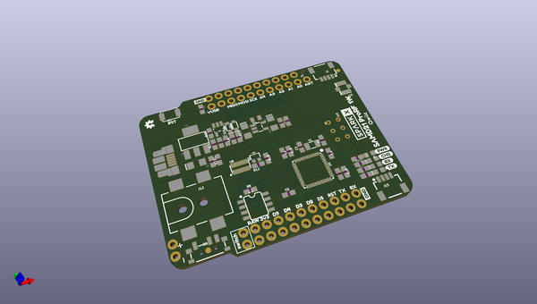
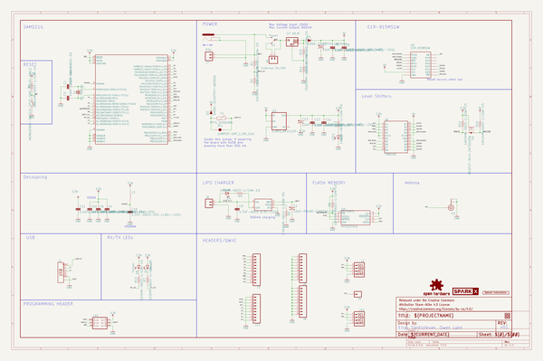
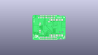
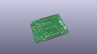
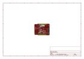
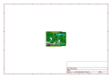
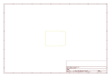
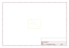
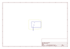
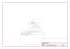

# OOMP Project  
## SAMD21_ProRF_1W  by sparkfunX  
  
oomp key: oomp_projects_flat_sparkfunx_samd21_prorf_1w  
(snippet of original readme)  
  
SparkFun SAMD21 Pro RF 1W   
========================================  
  
  
  
[*SparkFun SAMD21 Pro RF 1W  (SPX-14984)*](https://www.sparkfun.com/products/14984)  
  
LoRa stands for 'Long-Range,' referring to a modulation technique whose specialty is low power transmission of small data packets -- perfect for Internet of Things applications. Using either point-to-point radio or LoRaWAN you can send data from a node in a remote location back to your base station to check in on sensors or track equipment. Communication is possible in the other direction as well to send commands or control actuators!  
  
Like the [LoRa®-enabled SparkX Pro RF](https://www.sparkfun.com/products/14785) this board is based on the Semtech SX1276 transceiver, but the module boasts a whopping 1W output power. All that extra oomph makes it possible to send small messages up to 9 miles using common rubber-duck type antennas.   
  
In addition to more transmission power the SparkX SAMD21 ProRF 1W gets more computational power courtesy of the SAMD21 microcontroller running at 48 MHz. We used the additional GPIO pins to permanently enable LoRaWAN signals. This means more pins for you to connect to sensors and actuators, even when connecting to a LoRaWAN network like [The Things Network](https://console.thethingsnetwork.org/).   
  
  
SparkFun labored with love to create this code. Feel like supporting open source ha  
  full source readme at [readme_src.md](readme_src.md)  
  
source repo at: [https://github.com/sparkfunX/SAMD21_ProRF_1W](https://github.com/sparkfunX/SAMD21_ProRF_1W)  
## Board  
  
  
## Schematic  
  
  
  
[schematic pdf](working_schematic.pdf)  
## Images  
  
  
  
  
  
  
  
  
  
  
  
  
  
  
  
  
