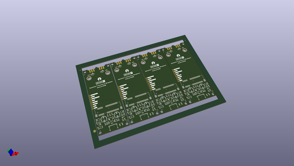
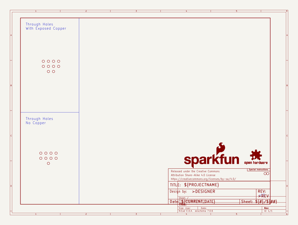
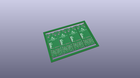
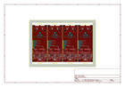
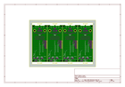
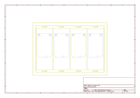
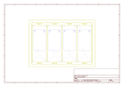
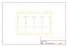
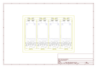

# OOMP Project  
## Satellite_Transceiver_Breakout__Swarm_M138  by sparkfunX  
  
oomp key: oomp_projects_flat_sparkfunx_satellite_transceiver_breakout_swarm_m138  
(snippet of original readme)  
  
- Satellite Transceiver Breakout - Swarm M138  
  
  
  
[*SparkFun Satellite Transceiver Kit - Swarm M138*](https://www.sparkfun.com/products/21287)  
  
A breakout for the Swarm M138 satellite transceiver.  
  
This breakout allows you to power and communicate with the Swarm M138 using USB 3 or USB-C, or breakout pins.  
  
We've written a Python3 PyQt5 GUI to let you communicate with the modem. You will find it in its own dedicated repo:  
- [**SparkFun Swarm M138 GUI**](https://github.com/sparkfun/SparkFun_Swarm_M138_GUI)  
  
You will find the modem manual in the [**Documents**](./Documents) folder. It contains the full list of modem commands and messages.  
  
You can also integrate the satellite transceiver directly into your project; the breakout pads can be used to provide power and access the 3.3V UART TX and RX signals.  
  
Open the two split jumper pads on the bottom of the PCB first, located between the TXO/CH340_RXI and RXI/CH340_TXO pads. Then connect:  
* GND to GND on your Arduino board  
* VIN to 5V/V_USB on your Arduino board  
* TXO to RX on your Arduino board (3.3V only!)  
* RXI to TX on your Arduino board (3.3V only!)  
  
Our [Swarm Satellite Arduino Library](https://github.com/sparkfun/SparkFun_Swarm_Satellite_Arduino_Library) makes communicating with the modem really easy.  
  
-- Repository Contents  
  
- [**/Hardware**](./Hardware) - conta  
  full source readme at [readme_src.md](readme_src.md)  
  
source repo at: [https://github.com/sparkfunX/Satellite_Transceiver_Breakout__Swarm_M138](https://github.com/sparkfunX/Satellite_Transceiver_Breakout__Swarm_M138)  
## Board  
  
  
## Schematic  
  
  
  
[schematic pdf](working_schematic.pdf)  
## Images  
  
  
  
  
  
  
  
  
  
  
  
  
  
  
  
  
