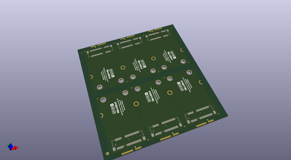
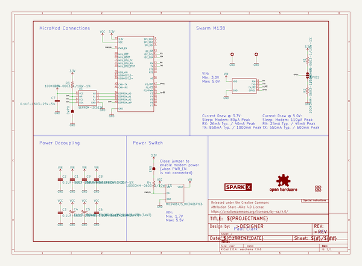
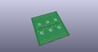
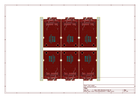
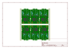
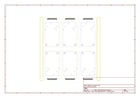
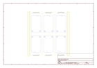
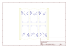
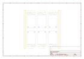

# OOMP Project  
## Satellite_Transceiver_Function_Board__Swarm_M138  by sparkfunX  
  
(snippet of original readme)  
  
SparkX Satellite Transceiver Function Board - Swarm M138  
========================================  
  

  
    
    
    
    

  
  
  
  
*[SparkX Satellite Transceiver Function Board - Swarm M138 (SPX-20107)](https://www.sparkfun.com/products/20107)*  
  
The [SparkX Satellite Transceiver Function Board - Swarm M138 (SPX-20107)](https://www.sparkfun.com/products/20107) is an adapter which allows you to add Swarm Satellite connectivity  
to your [MicroMo  
  full source readme at [readme_src.md](readme_src.md)  
  
source repo at: [https://github.com/sparkfunX/Satellite_Transceiver_Function_Board__Swarm_M138](https://github.com/sparkfunX/Satellite_Transceiver_Function_Board__Swarm_M138)  
## Board  
  
  
## Schematic  
  
  
  
[schematic pdf](working_schematic.pdf)  
## Images  
  
  
  
  
  
  
  
  
  
  
  
  
  
  
  
  
