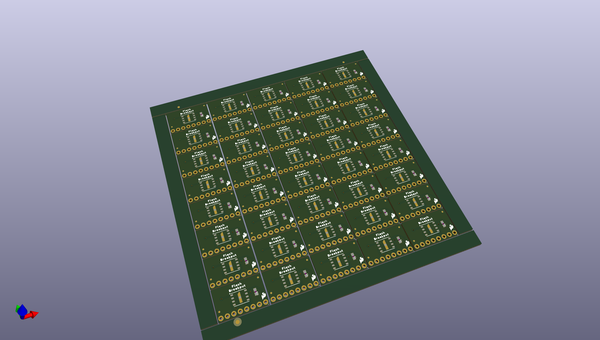
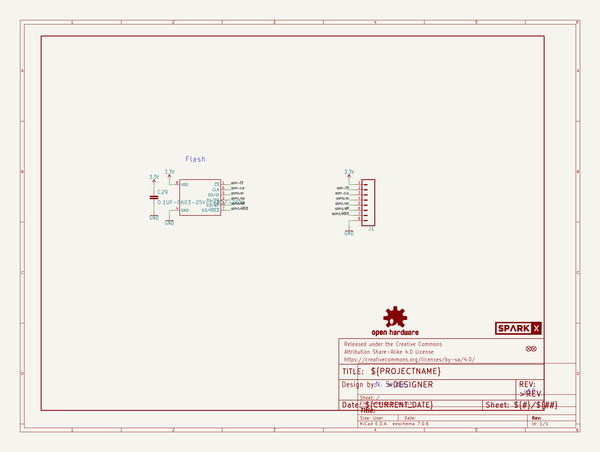

# OOMP Project  
## SerialFlash-Breakout  by sparkfunX  
  
oomp key: oomp_projects_flat_sparkfunx_serialflash_breakout  
(snippet of original readme)  
  
SerialFlash-Breakout  
========================================  
  
  
  
[*Serial Flash Breakout - Assembled*](https://www.sparkfun.com/products/17115)  
  
[*Serial Flash Breakout - Bare*](https://www.sparkfun.com/products/17116)  
  
Serial flash chips are everywhere and they're as useful as they are ubiquitous. If you've never used a serial flash device in your own projects, you should try it, because it's very handy to have a place to store things that don't fit in program memory. Things like sensor readings, long strings, and error logs can be hard to stow away on platforms that don't have a ton of in-built storage, which is where serial flash comes in. Simply write all of that data out over SPI for the flash chip to hold on to and retrieve it later! And thanks to their ubiquity, these chips have been largely standardized not only in terms of their software interface but also their hardware footprint, so there are plenty of serial flash chips to choose from.  
  
SparkFun labored with love to design this board. Feel like supporting open source hardware?   
Buy a [board](https://www.sparkfun.com/products/17115) from SparkFun!  
  
Repository Contents  
-------------------  
  
* **/Hardware** - Eagle design files (.brd, .sch)  
* **/Documents** - Datasheet  
* **/Production** - Production design files  
  
  
License Information  
-------------------  
  
This product is _**open source**_  
  full source readme at [readme_src.md](readme_src.md)  
  
source repo at: [https://github.com/sparkfunX/SerialFlash-Breakout](https://github.com/sparkfunX/SerialFlash-Breakout)  
## Board  
  
  
## Schematic  
  
  
  
[schematic pdf](working_schematic.pdf)  
## Images  
