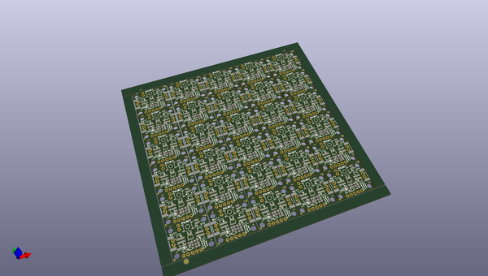
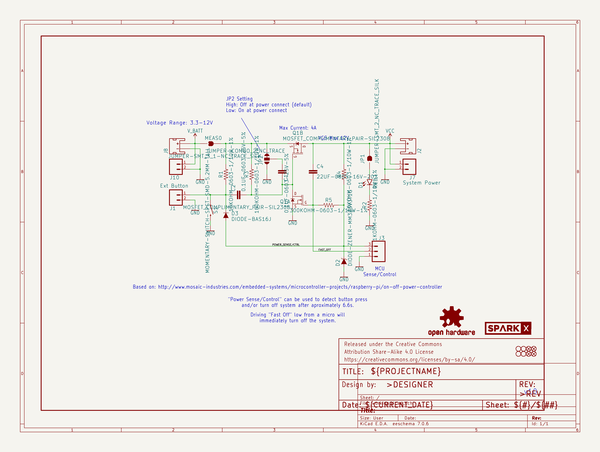
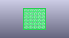
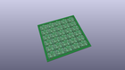
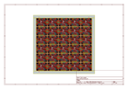
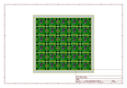
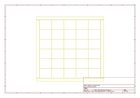
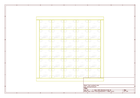
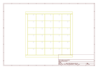
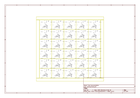

# OOMP Project  
## Soft_Power_Switch  by sparkfunX  
  
(snippet of original readme)  
  
SparkX Soft Power Switch  
===================================================  
  
  
  
[*SparkX Soft Power Switch (SPX-17870)*](https://www.sparkfun.com/products/17870)  
  
  
  
  
  
The Soft Power Switch is a passive, hard on/off switch with software feedback and control. In other words, it's like the on/off switch on a laptop. A simple press will turn the system on. Another press can (with MCU intervention) turn off the system. And if things go really wrong, pressing and holding the button will force a power-down. If you're building something with an enclosed battery and need a good power button, this is the board you need.  
  
The Sense/Control pin can act as an output to a microcontroller indicating the state of the power button (high = not pressed, low = user in pressing power button). This can be used as an input to your firmware to begin to shut down before power is lost. Alternatively, the Sense/Control pin can be driven low by the system forcing power off via software. Additionally, the Fast Off pin can be used to immediately power down a system.  
  
The most common use case is something like this:  
  
* Microcontroller begins running code and checks to see if power button is  
  full source readme at [readme_src.md](readme_src.md)  
  
source repo at: [https://github.com/sparkfunX/Soft_Power_Switch](https://github.com/sparkfunX/Soft_Power_Switch)  
## Board  
  
  
## Schematic  
  
  
  
[schematic pdf](working_schematic.pdf)  
## Images  
  
  
  
  
  
  
  
  
  
  
  
  
  
  
  
  
