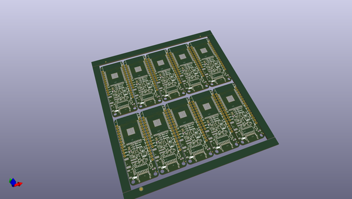
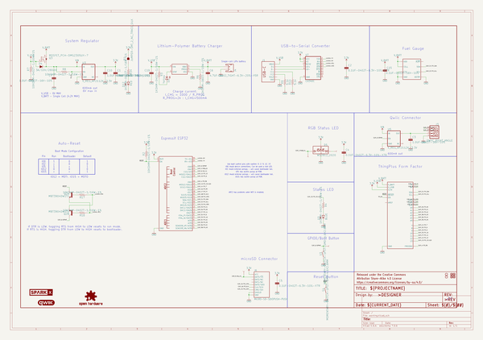
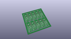
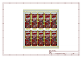
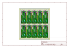
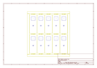
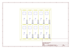
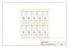

# OOMP Project  
## SparkFun_ESP32_Thing_Plus_C  by sparkfunX  
  
oomp key: oomp_projects_flat_sparkfunx_sparkfun_esp32_thing_plus_c  
(snippet of original readme)  
  
SparkFun ESP32 Thing Plus C  
========================================  
  
  
  
[*SparkFun ESP32 Thing Plus C (SPX-18018)*](https://www.sparkfun.com/products/18018)  
  
The [SparkFun ESP32 Thing Plus C](https://www.sparkfun.com/products/18018) is a comprehensive development platform for [Espressif's ESP32](https://espressif.com/en/products/hardware/esp32/overview). Like the 8266 and ESP32 Thing, the ESP32 Thing Plus is a **WiFi**-compatible microcontroller with support for both **Bluetooth Classic** (i.e. SPP) and **Bluetooth low-energy** (i.e. BLE, BT4.0, Bluetooth Smart), a Qwiic connector, and 21 I/O pins. Add to that a rich set of peripherals ranging from capacitive touch sensors, Hall sensors, SD card interface, Ethernet, high-speed SPIs, UARTs, I2S and I2C.  
  
We took all the good from the original [ESP32 Thing Plus](https://www.sparkfun.com/products/15663) and sprinkled on some more! USB C provides up to 2A, upgraded 16MB flash ESP32 WROOM module, CH340 USB to serial IC, an onboard fuel gauge IC will make sure you know your battery levels, and an onboard addressable LED is perfect for as a multi-status LED. Oh, and the new taller reset and boot buttons are *so* much easier to push!  
  
We added a dedicator regulator to the Qwiic connector to enable software power control of the Qwiic bus - great for low power logg  
  full source readme at [readme_src.md](readme_src.md)  
  
source repo at: [https://github.com/sparkfunX/SparkFun_ESP32_Thing_Plus_C](https://github.com/sparkfunX/SparkFun_ESP32_Thing_Plus_C)  
## Board  
  
  
## Schematic  
  
  
  
[schematic pdf](working_schematic.pdf)  
## Images  
  
  
  
  
  
  
  
  
  
  
  
  
  
  
  
  
