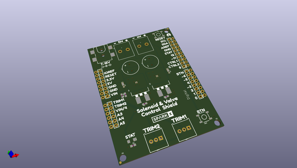
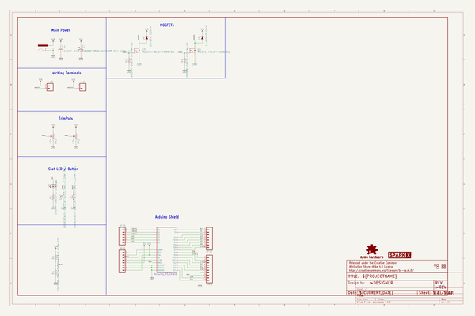
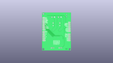
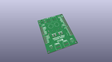
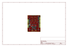
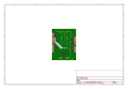
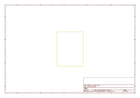
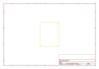
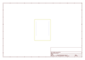
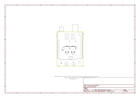

# OOMP Project  
## SparkFun_Valve_Control_Shield  by sparkfunX  
  
oomp key: oomp_projects_flat_sparkfunx_sparkfun_valve_control_shield  
(snippet of original readme)  
  
SparkFun Dual Valve and Solenoid Control  
===========================================================  
  
License Information  
-------------------  
  
This product is _**open source**_!   
  
Various bits of the code have different licenses applied. Anything SparkFun wrote is beerware; if you see me (or any other SparkFun employee) at the local, and you've found our code helpful, please buy us a round!  
  
* Hardware license: CERN 1.2  
* Software License: MIT  
* Documentation: CC BY-SA 4.0  
  
Please use, reuse, and modify these files as you see fit. Please maintain attribution to SparkFun Electronics and release anything derivative under the same license.  
  
Distributed as-is; no warranty is given.  
  
- Your friends at SparkFun.  
  
  full source readme at [readme_src.md](readme_src.md)  
  
source repo at: [https://github.com/sparkfunX/SparkFun_Valve_Control_Shield](https://github.com/sparkfunX/SparkFun_Valve_Control_Shield)  
## Board  
  
  
## Schematic  
  
  
  
[schematic pdf](working_schematic.pdf)  
## Images  
  
  
  
  
  
  
  
  
  
  
  
  
  
  
  
  
