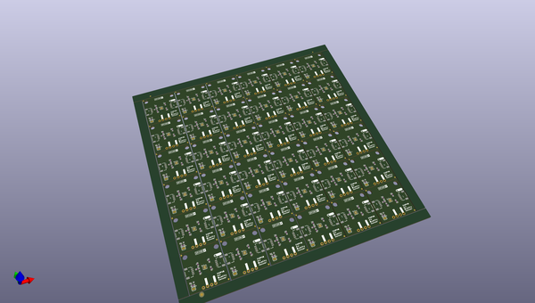
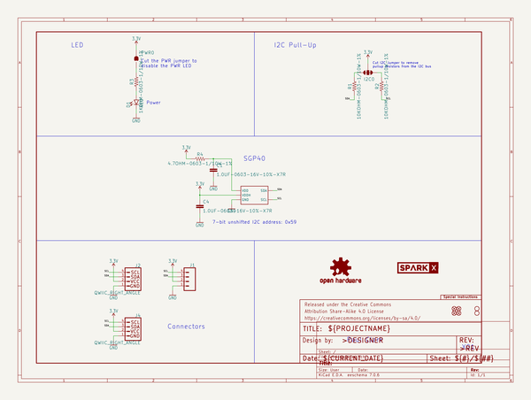
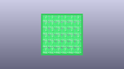
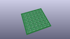
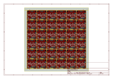
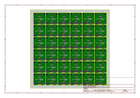
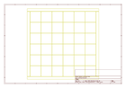
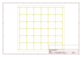
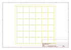
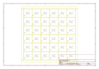

# OOMP Project  
## SparkX_Air_Quality_Sensor-SGP40  by sparkfunX  
  
(snippet of original readme)  
  
SparkX Air Quality Sensor - SGP40 (Qwiic)  
========================================  
  
  
  
[*SparkX Air Quality Sensor - SGP40 (Qwiic) (SPX-17729)*](https://www.sparkfun.com/products/17729)  
  
  
  
The SGP40 is a digital gas sensor designed for easy integration into air purifiers or demand-controlled ventilation systems.  
Sensirion’s CMOSens® technology offers a complete, easy to use sensor system on a single chip featuring a digital  
I2C interface and a temperature controlled micro hotplate, providing a humidity compensated VOC based indoor air quality signal.  
The output signal can be directly processed by Sensirion’s powerful VOC Algorithm to translate the raw signal into a VOC Index as a robust  
measure for indoor air quality. The VOC Algorithm automatically adapts to the environment the sensor is exposed to. Both sensing element and  
VOC Algorithm feature an unmatched robustness against contaminating gases present in real world applications enabling a unique long term  
stability as well as low drift and device to device variation.  
  
Repository Contents  
-------------------  
* **/Documents** - datasheets etc.  
* **/Hardware** - Eagle design files (.brd, .sch)  
  
Documentation  
--------------  
* **[SGP40 Arduino Library](https://github.com/sparkfun/SparkFun  
  full source readme at [readme_src.md](readme_src.md)  
  
source repo at: [https://github.com/sparkfunX/SparkX_Air_Quality_Sensor-SGP40](https://github.com/sparkfunX/SparkX_Air_Quality_Sensor-SGP40)  
## Board  
  
  
## Schematic  
  
  
  
[schematic pdf](working_schematic.pdf)  
## Images  
  
  
  
  
  
  
  
  
  
  
  
  
  
  
  
  
