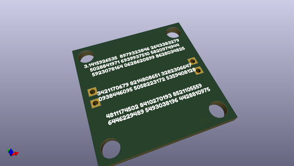
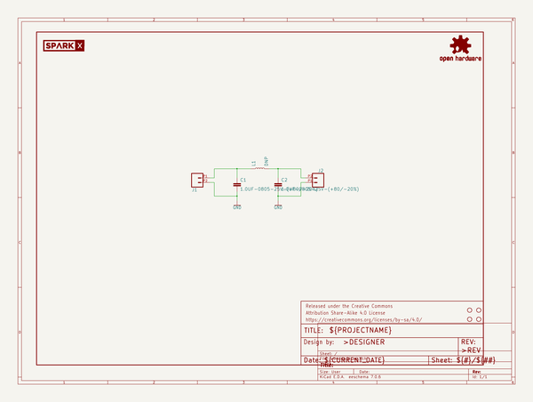

# OOMP Project  
## SparkX-Pi-Filter-Breakout  by sparkfunX  
  
(snippet of original readme)  
  
Pi Filter Breakout  
========================================  
  
  
  
[*Pi Filter Breakout (SPX-15260)*](https://www.sparkfun.com/products/15260)  
  
It’s 2pm on a Tuesday and you find yourself at the test house with a design failing an emissions test. You quickly determine that you need to hack a filter onto your design but there is no space to do so. If only you had a simple board you could attach to the product. Introducing the Pi-Filter! This simple board gets the name Pi-Filter from its shape, which resembles the Greek letter Pi. It has two shunt capacitors with an inductor in between. In this C-L-C configuration, a person can quickly implement a low pass filter.  
  
Repository Contents  
-------------------  
  
* **/Hardware** - Eagle design files (.brd, .sch)  
  
License Information  
-------------------  
  
This product is _**open source**_!   
  
Please review the LICENSE.md file for license information.   
  
If you have any questions or concerns on licensing, please contact techsupport@sparkfun.com.  
  
Distributed as-is; no warranty is given.  
  
- Your friends at SparkFun.  
  
  
  full source readme at [readme_src.md](readme_src.md)  
  
source repo at: [https://github.com/sparkfunX/SparkX-Pi-Filter-Breakout](https://github.com/sparkfunX/SparkX-Pi-Filter-Breakout)  
## Board  
  
  
## Schematic  
  
  
  
[schematic pdf](working_schematic.pdf)  
## Images  
