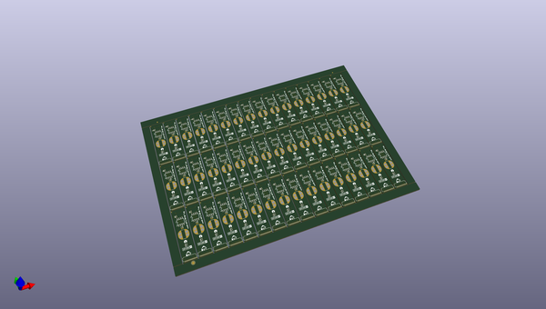
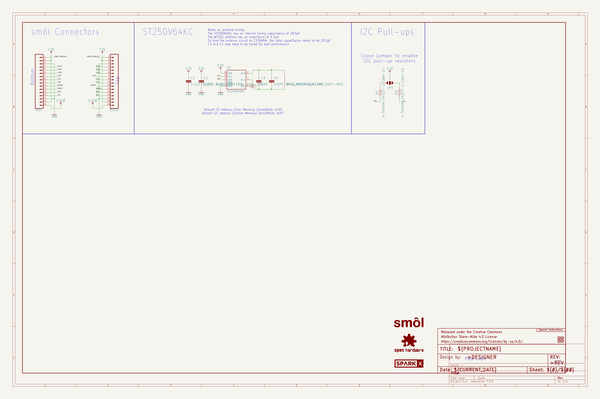
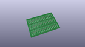
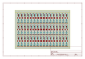
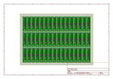
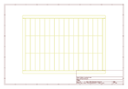
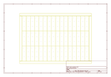
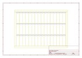
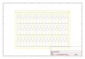

# OOMP Project  
## SparkX_smol_Dynamic_NFC_RFID_Tag  by sparkfunX  
  
oomp key: oomp_projects_flat_sparkfunx_sparkx_smol_dynamic_nfc_rfid_tag  
(snippet of original readme)  
  
- SparkX smôl Dynamic NFC/RFID Tag  
  
  
  
[*SparkX smôl Dynamic NFC/RFID Tag (SPX-18991)*](https://www.sparkfun.com/products/18991)  
  
You might be wondering why we would make an NFC/RFID tag peripheral board for smôl? The STMicroelectronics ST25FV64KC is a _**dynamic**_ Near Frequency Communication / Radio Frequency Identification tag IC with 64Kbit (8KByte) of on-board EEPROM memory. It has an I2C interface which the smôl processor board can use to read and write to the EEPROM memory. But the memory can also be read and written to over the RF link _while your smôl ecosystem is in deep sleep_! This means it is perfect for: contactless data storage and collection; and for configuration.  
  
-- Repository Contents  
  
- **/Hardware** - Eagle design files  
- **LICENSE.md** contains the licence information  
  
-- Product Versions  
  
- [SPX-18991](https://www.sparkfun.com/products/18991) - Original SparkX Release.  
  
-- License Information  
  
This product is _**open source**_!  
  
Please review the LICENSE.md file for license information.  
  
If you have any questions or concerns on licensing, please contact technical support on our [SparkFun forums](https://forum.sparkfun.com/viewforum.php?f=123).  
  
Distributed as-is; no warranty is given.  
  
- Your friends at SparkFun.  
  
  full source readme at [readme_src.md](readme_src.md)  
  
source repo at: [https://github.com/sparkfunX/SparkX_smol_Dynamic_NFC_RFID_Tag](https://github.com/sparkfunX/SparkX_smol_Dynamic_NFC_RFID_Tag)  
## Board  
  
  
## Schematic  
  
  
  
[schematic pdf](working_schematic.pdf)  
## Images  
  
  
  
  
  
  
  
  
  
  
  
  
  
  
  
  
