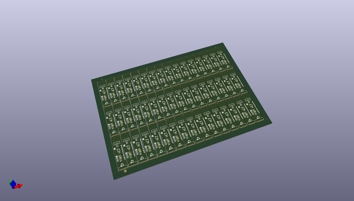
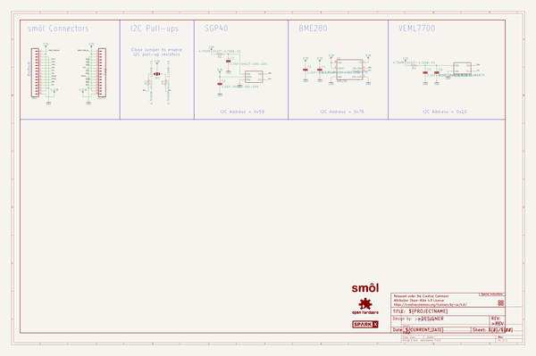

# OOMP Project  
## SparkX_smol_Environmental  by sparkfunX  
  
(snippet of original readme)  
  
- SparkX smôl Environmental Peripheral Board  
  
  
  
[*SparkX smôl Environmental Peripheral Board (SPX-18976)*](https://www.sparkfun.com/products/18976)  
  
An environmental board for smôl:  
- **BME280** - Pressure, Humidity and Temperature sensor  
- **SGP40** - VOC air quality sensor  
- **VEML7700** - ambient light sensor (top view)  
  
-- Repository Contents  
  
- [**/Hardware**](./Hardware) - Eagle PCB, SCH and LBR design files  
- [**LICENSE.md**](./LICENSE.md) - contains the licence information  
  
-- Product Versions  
  
- [SPX-18976](https://www.sparkfun.com/products/18976) - Original SparkX Release.  
  
-- License Information  
  
This product is _**open source**_!  
  
Please review the LICENSE.md file for license information.  
  
If you have any questions or concerns on licensing, please contact technical support on our [SparkFun forums](https://forum.sparkfun.com/viewforum.php?f=123).  
  
Distributed as-is; no warranty is given.  
  
- Your friends at SparkFun.  
  
  full source readme at [readme_src.md](readme_src.md)  
  
source repo at: [https://github.com/sparkfunX/SparkX_smol_Environmental](https://github.com/sparkfunX/SparkX_smol_Environmental)  
## Board  
  
  
## Schematic  
  
  
  
[schematic pdf](working_schematic.pdf)  
## Images  
