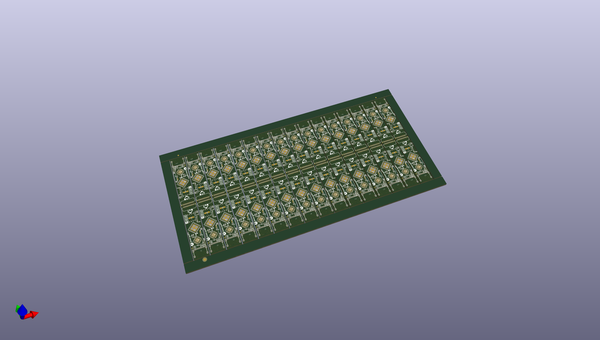
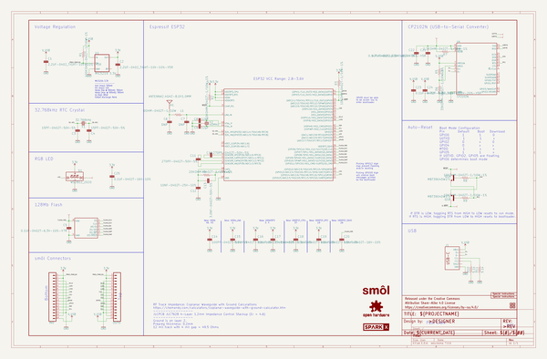
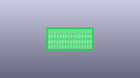
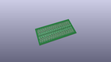
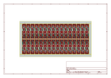
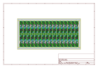
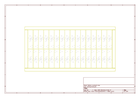
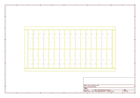
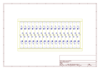
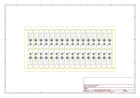

# OOMP Project  
## SparkX_smol_ESP32  by sparkfunX  
  
(snippet of original readme)  
  
- SparkX smôl ESP32  
  
  
  
[*SparkX smôl ESP32 (SPX-18619)*](https://www.sparkfun.com/products/18619)  
  
The ESP32 in smôl format:  
- ESP32 Processor  
- WiFi antenna  
- RTC crystal  
- WS2812 RGB LED  
- WS25Q128 128Mb Flash memory  
- USB-C connector  
- CP2102N USB-UART interface with RESET and BOOT control  
  
  
  
-- Repository Contents  
  
- **/examples** - Example code for the Arduino IDE  
- **/Documentation** - Datasheets etc.  
- **/Hardware** - Eagle design files  
- **LICENSE.md** contains the licence information  
  
-- Product Versions  
  
- [SPX-18619](https://www.sparkfun.com/products/18619) - Original SparkX Release.  
  
-- License Information  
  
This product is _**open source**_!  
  
Please review the LICENSE.md file for license information.  
  
If you have any questions or concerns on licensing, please contact technical support on our [SparkFun forums](https://forum.sparkfun.com/viewforum.php?f=123).  
  
Distributed as-is; no warranty is given.  
  
- Your friends at SparkFun.  
  
  full source readme at [readme_src.md](readme_src.md)  
  
source repo at: [https://github.com/sparkfunX/SparkX_smol_ESP32](https://github.com/sparkfunX/SparkX_smol_ESP32)  
## Board  
  
  
## Schematic  
  
  
  
[schematic pdf](working_schematic.pdf)  
## Images  
  
  
  
  
  
  
  
  
  
  
  
  
  
  
  
  
