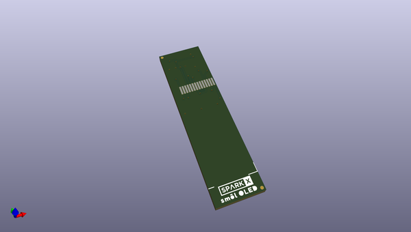
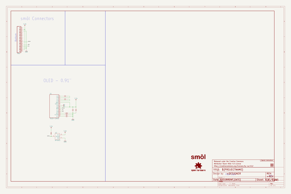
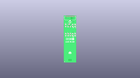
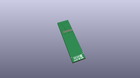
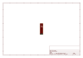
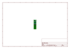
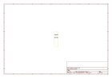
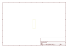
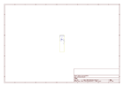
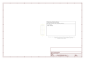

# OOMP Project  
## SparkX_smol_OLED_Display  by sparkfunX  
  
(snippet of original readme)  
  
- SparkX smôl Header  
  
  
  
[*SparkX smôl OLED Display (SPX-18996)*](https://www.sparkfun.com/products/18996)  
  
The smôl OLED Display is a high contrast, small monochrome display with 128 x 32 pixels. Perfect for applications that don't possess a lot of space but still need to communicate to the user. The display uses the common SSD1306 driver IC fully supported by our blistering fast [SparkFun Qwiic OLED Library](https://github.com/sparkfun/SparkFun_Qwiic_OLED_Arduino_Library).  
  
  
-- Repository Contents  
  
- **/Dosuments** - Driver datasheet  
- **/Hardware** - Eagle design files  
- **LICENSE.md** contains the licence information  
  
  
-- License Information  
  
This product is _**open source**_!  
  
Please review the LICENSE.md file for license information.  
  
If you have any questions or concerns on licensing, please contact technical support on our [SparkFun forums](https://forum.sparkfun.com/viewforum.php?f=123).  
  
Distributed as-is; no warranty is given.  
  
- Your friends at SparkFun.  
  
  full source readme at [readme_src.md](readme_src.md)  
  
source repo at: [https://github.com/sparkfunX/SparkX_smol_OLED_Display](https://github.com/sparkfunX/SparkX_smol_OLED_Display)  
## Board  
  
  
## Schematic  
  
  
  
[schematic pdf](working_schematic.pdf)  
## Images  
  
  
  
  
  
  
  
  
  
  
  
  
  
  
  
  
