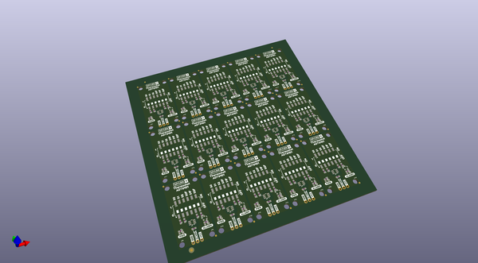
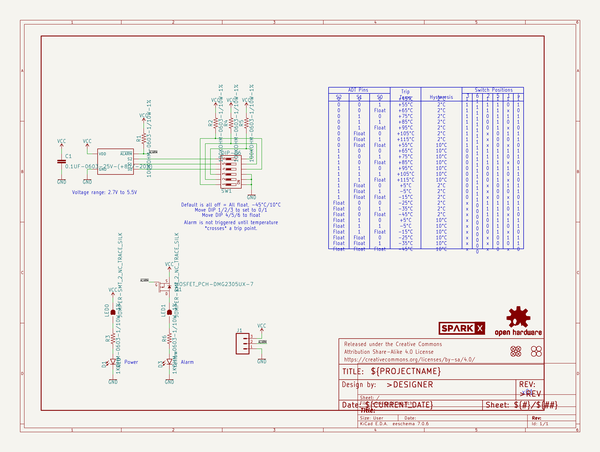
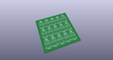
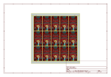
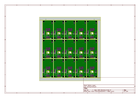
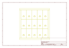
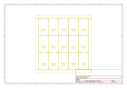
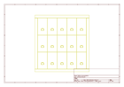
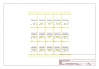

# OOMP Project  
## Thermostat_ADT6401_Breakout  by sparkfunX  
  
(snippet of original readme)  
  
SparkFun Auto-Digital Thermostat - ADT6401  
=============================  
  
  
  
New from SparkX, the ADT6401 breakout board. This IC triggers alarm pin and LED when the temperature reading crosses a temperature trip point. Set the trip point easily using the SPDT switches included on the breakout.  
  
SparkFun labored with love to design this board. Feel like supporting open-source hardware?  
Buy a [board](https://www.sparkfun.com/) from SparkFun!  
  
Repository Contents  
-------------------  
  
* **/Documents** - Datasheet for the ADT6401 IC.  
* **/Hardware** - Eagle design files (.brd, .sch).  
* **/Production** - Production panel files (.brd).  
  
License Information  
-------------------  
  
This product is _**open source**_!  
  
Please review the LICENSE.md file for license information.  
  
If you have any questions or concerns regarding our licensing, please contact technical support on our [SparkFun Forum](https://www.sparkfun.com/viewforum.php?f=152).  
  
Distributed as-is; no warranty is given.  
  
- Your friends at SparkFun  
  
_<COLLABORATION CREDIT>_  
  
  full source readme at [readme_src.md](readme_src.md)  
  
source repo at: [https://github.com/sparkfunX/Thermostat_ADT6401_Breakout](https://github.com/sparkfunX/Thermostat_ADT6401_Breakout)  
## Board  
  
  
## Schematic  
  
  
  
[schematic pdf](working_schematic.pdf)  
## Images  
  
  
  
  
  
  
  
  
  
  
  
  
  
  
  
  
