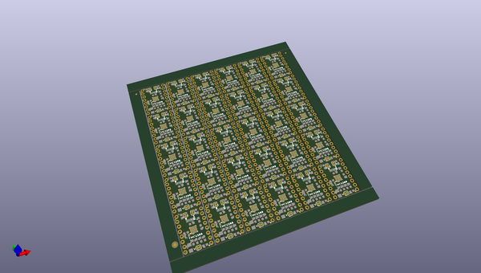
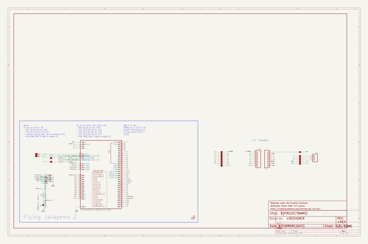

# OOMP Project  
## Three_Phase_Motor_Driver-TMC6300  by sparkfunX  
  
oomp key: oomp_projects_flat_sparkfunx_three_phase_motor_driver_tmc6300  
(snippet of original readme)  
  
SparkFun 3-Phase BLDC Motor Driver - TMC6300  
========================================  
  
  
  
[*SparkFun 3-Phase BLDC Motor Driver - TMC6300(ROB-21220)*](https://www.sparkfun.com/products/21220)  
  
The TMC6300 from Trinamic is a powerful, yet easy to use three phase brushless DC (BLDC) motor driver. Separate high side and low side controls allow for incredible control up to 2A of current. The driver is temperature and short circuit protected with a diagnostic output pin to indicate system issues. With an operating voltage down to 2V, the TMC6300 is suitable for battery powered designs.  
  
We've designed an innovative 2 sided, 4 layer breakout board to make hookup as easy as possible. The board is mounted with LEDs and labels facing up, IC down. This allows the thermal pad on the board to be access if cooling is required.   
  
Controlling 3-phase BLDC motors is not trivial. This board requires 6 PWM signals to fully control one motor. We've found the [*Arduino Simple Field Oriented Control*](https://docs.simplefoc.com/) library to be very good. The [open loop example](https://github.com/simplefoc/Arduino-FOC/blob/master/examples/motion_control/open_loop_motor_control/open_loop_velocity_example/open_loop_velocity_example.ino) combined with the [6 channel PWM method](https://docs.simplefoc.com/bldcdriver6pwm) and *every* PWM pin on th  
  full source readme at [readme_src.md](readme_src.md)  
  
source repo at: [https://github.com/sparkfunX/Three_Phase_Motor_Driver-TMC6300](https://github.com/sparkfunX/Three_Phase_Motor_Driver-TMC6300)  
## Board  
  
  
## Schematic  
  
  
  
[schematic pdf](working_schematic.pdf)  
## Images  
