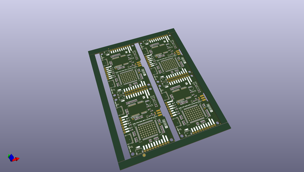
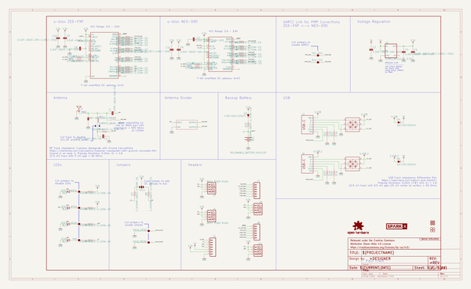

# OOMP Project  
## u-blox_ZED-F9P_NEO-D9S_Combo_Breakout  by sparkfunX  
  
oomp key: oomp_projects_flat_sparkfunx_u_blox_zed_f9p_neo_d9s_combo_breakout  
(snippet of original readme)  
  
- SparkX u-blox ZED-F9P NEO-D9S Combo Breakout  
  

  
    
    
    
    

  
  
  
  
*[SparkX u-blox ZED-F9P NEO-D9S Combo Breakout (SPX-20167)](https://www.sparkfun.com/products/20167)*  
  
The [SparkX u-blox ZED-F9P NEO-D9S Combo Breakout (SPX-20167)](https://www.sparkfun.com/products/20167) combines the u-blox ZED-F9P multi-band high precision GNSS module  
with the NEO-D9S L-band GNSS correction data receiver. With a clear view of the sky, especially a clear view to the South, this combo breakout   
  full source readme at [readme_src.md](readme_src.md)  
  
source repo at: [https://github.com/sparkfunX/u-blox_ZED-F9P_NEO-D9S_Combo_Breakout](https://github.com/sparkfunX/u-blox_ZED-F9P_NEO-D9S_Combo_Breakout)  
## Board  
  
  
## Schematic  
  
  
  
[schematic pdf](working_schematic.pdf)  
## Images  
