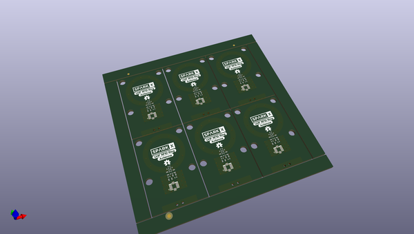
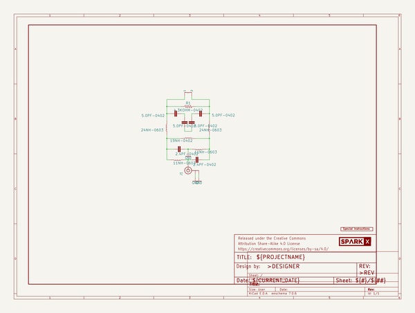

# OOMP Project  
## UHF_RFID_Ring_Antenna  by sparkfunX  
  
(snippet of original readme)  
  
UHF RFID Ring Antenna  
=============================  
  
  
  
A small ring antenna for use with Ultra-small UHF RFID tags  
  
Repository Contents  
-------------------  
  
* **/Documents** - Documentation  
* **/Hardware** - Eagle design files (.brd, .sch)  
  
License Information  
-------------------  
  
This product is _**open source**_!   
  
Please review the LICENSE.md file for license information.   
  
If you have any questions or concerns on licensing, please contact technical support on our [SparkFun forums](https://forum.sparkfun.com/viewforum.php?f=152).  
  
Distributed as-is; no warranty is given.  
  
- Your friends at SparkFun.  
  full source readme at [readme_src.md](readme_src.md)  
  
source repo at: [https://github.com/sparkfunX/UHF_RFID_Ring_Antenna](https://github.com/sparkfunX/UHF_RFID_Ring_Antenna)  
## Board  
  
  
## Schematic  
  
  
  
[schematic pdf](working_schematic.pdf)  
## Images  
