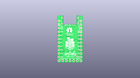
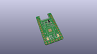
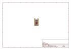
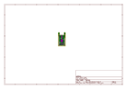
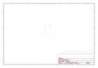
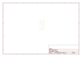
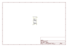

# OOMP Project  
## 0xB2  by TahuTech  
  
oomp key: oomp_projects_flat_tahutech_0xb2  
(snippet of original readme)  
  
- 0xB2 - splinky  
Pro-Micro/Elite-C replacement with USB-C and RP2040.  
  
Designed for use in custom mechanical (split) keyboards, but many other uses are possible.  
  
  
  
-- Features:  
  
 * Pro-micro / Sparkfun RP2040 compatible footprint, with 5 extra pins at bottom (Elite-C style)  
 * Raspberry Pi RP2040 MCU  
 * Up to 16MB flash memory _(depending on component selection and availability)_  
 * User LED & USB VBUS detect  
 * Low profile USB-C mid-mount connector  
 * Designed to be manufactured and assembled by all common PCBA services (including JLCPCB)  
  
<!---->  
  
-- Pinout  
  
The pinout is compatible with the widely available [SparkFun RP2040](https://www.sparkfun.com/products/18288), with extra GPIO12..16 pins broken out on the lower side.  
  
USB VBUS detection on GPIO19.  
  
> This pinout is a _de facto_ standard, established by actors of the MK community (see discussions in `-RP2040` on the bastardkb Discord server)   
  
Additionnaly, a user LED is tied to GPIO17, can be used for UF2 bootloader status indication, or any other purpose (or turned OFF, no annoying always-on power LED).  
  
-- Programming  
  
The splinky uses a basic two-button reset circuitry.  
  
In order to put the board in bootloader mode, press briefly the RESET button (marked **R**) while holding the BOOT button (the second one).  
If the buttons are not reachable (soldered upside down), the /RST pad can be sh  
  full source readme at [readme_src.md](readme_src.md)  
  
source repo at: [https://github.com/TahuTech/0xB2](https://github.com/TahuTech/0xB2)  
## Board  
  
  
## Schematic  
  
  
  
[schematic pdf](working_schematic.pdf)  
## Images  
  
  
  
  
  
  
  
  
  
  
  
  
  
  
  
  
