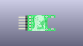
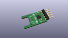
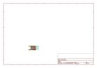
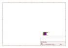
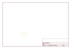
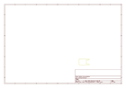
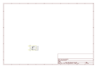

# OOMP Project  
## darling  by XenGi  
  
oomp key: oomp_projects_flat_xengi_darling  
(snippet of original readme)  
  
  
  
  
![pcb][pcb] ![3d model][3d]  
  
darling  
=======  
  
FTDI helper for the future. With FT230X, blinky lights and USB-C! Also potentially the tinyest USB-C to Serial adapter in the world. :smiley:  
  
__Got a smaller USB-C to serial adapter? Please send me a link!__  
  
  
BOM  
---  
  
| Part                 | Qty | Pkg   | Ref    | Description      |  
| -------------------- | -   | ----- | ------ | ---------------- |  
| Hirose CX70M-24P1    | 1   | -     | J1     | USB-C Receptacle |  
| FTDI FT230XQ-R       | 1   | QFN16 | U1     | USB-Serial IC    |  
| -                    | 1   | 0603  | D2     | Green TX LED     |  
| -                    | 1   | 0603  | D1     | Red RX LED       |  
| -                    | 2   | 0402  | R3, R4 | 270 Ohm Resistor |  
| -                    | 2   | 0402  | R1, R2 | 27 Ohm Resistor  |  
| -                    | 2   | 0402  | C5, C6 | 47 pF Capacitor  |  
| -                    | 1   | 0402  | C1     | 10 nF Capacitor  |  
| -                    | 1   | 0402  | C3     | 4.7 uF Capacitor |  
| -                    | 2   | 0402  | C2, C4 | 100 nF Capacitor |  
| Laird MI0805K601R-10 | 1   | 0805  | FB1    | Ferrite Bead     |  
  
See [Octopart][octopart] for a detailed list with links.  
With current prices this totals to € 3.84 just for parts excluding costs for the PCB manufacturing. If you need a PCB, just ask. I   
  full source readme at [readme_src.md](readme_src.md)  
  
source repo at: [https://github.com/XenGi/darling](https://github.com/XenGi/darling)  
## Board  
  
  
## Schematic  
  
  
  
[schematic pdf](working_schematic.pdf)  
## Images  
  
  
  
  
  
  
  
  
  
  
  
  
  
  
  
  
